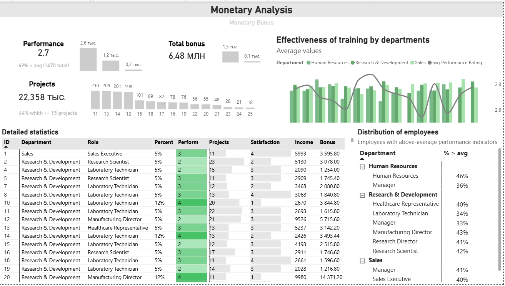
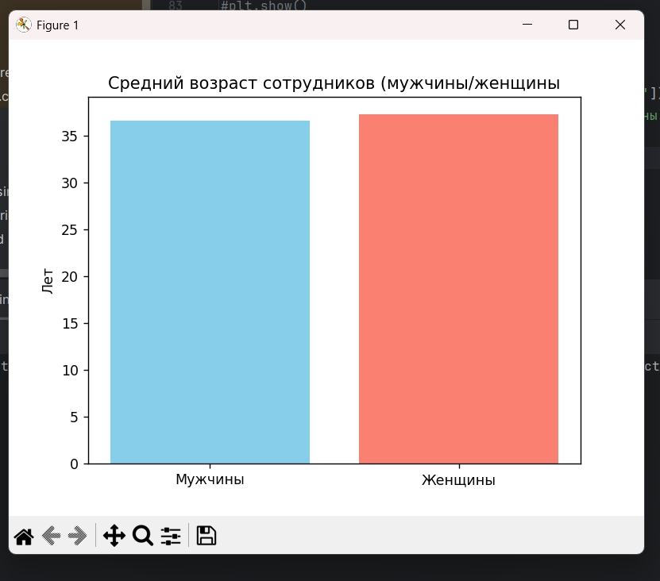
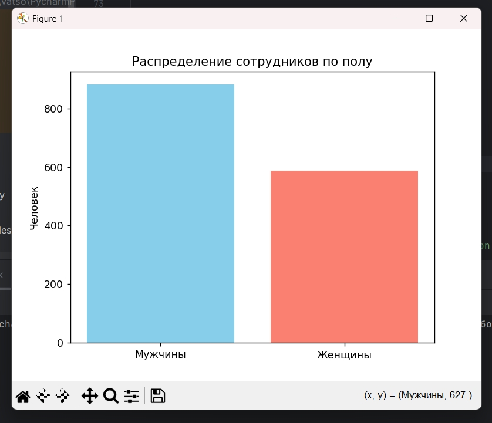
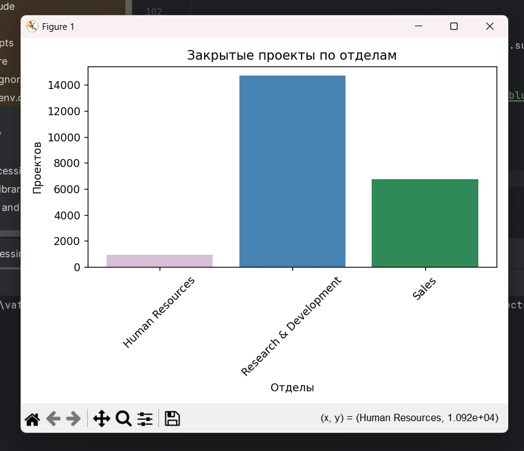
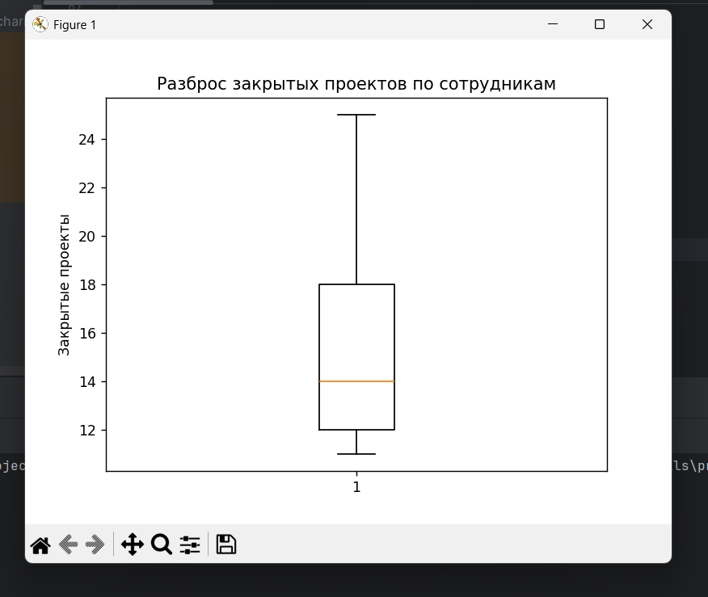
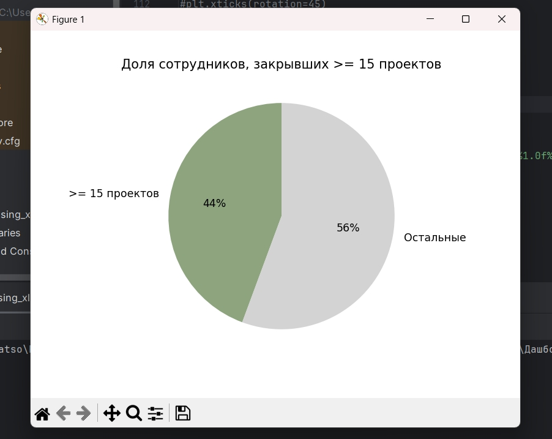

# Monetary-Analysis — Анализ HR-данных: расчёт премии и визуализация KPI сотрудников
## О проекте
Monetary-Analysis — Проект посвящён анализу эффективности сотрудников и расчёту годовой премии на основе показателей производительности. Основная цель — создание интерактивного дашборда в Power BI, а также предварительный анализ данных и расчёт премии в Python.

## Возможности
- **Расчёт годовой премии** — автоматическое распределение сотрудников по категориям (5%, 12%, 20%) на основе производительности и количества проектов
- **Интерактивный дашборд в Power BI** — визуализация KPI, распределения проектов, сравнение отделов и должностей
- **Предварительный анализ данных (EDA)** — статистика по сотрудникам, группировки, выбросы, средние значения
- **Визуализация в Python** — гистограммы, ящики с усами, круговые диаграммы для технической документации
- **Выводы для бизнеса** — анализ корреляции премии с объективными показателями и рекомендации по улучшению системы премирования

## Работа с данными:
- **Источник данных** — файл Excel (HR data monetary) с информацией о сотрудниках: возраст, пол, отдел, должность, зарплата, стаж, количество проектов, оценка производительности и др.
- **Обработка в Python (pandas)**:
  - Предварительный просмотр и очистка данных
  - Расчёт базовых метрик (количество сотрудников, средний возраст, распределение по полу и отделам)
  - Группировка и агрегация (суммы, средние значения)
  - Создание категорий премии (5%, 12%, 20%) на основе производительности и количества проектов
- **Визуализация в Python (matplotlib)** — гистограммы, ящики с усами, круговые диаграммы для предварительного анализа
- **Итоговая визуализация в Power BI** — построение интерактивного дашборда с KPI, матрицами, распределениями и фильтрами

## Аналитические способности:
- Расчёт годовой премии по категориям производительности
- Сравнение эффективности отделов и должностей
- Анализ распределения проектов и выбросов
- Проверка гипотез (стаж, обучение, удовлетворённость -> производительность)
- Вывод об отсутствии корреляции премии с объективными показателями

## Технологии
- **Python** 3.11+
- **pandas** >= 1.3.0
- **matplotlib** >= 3.5.0
- **Power BI** Desktop (бесплатная версия)
- **Формат данных** — Excel (.xlsx)


## Технические детали:
### Визуализация использует:
- **Power BI Desktop** — основной инструмент для построения интерактивного дашборда 
- **Matplotlib (Python)** — дополнительная визуализация для предварительного анализа и технической документации

## Результат:


## Предварительный анализ в консоли Python:







## Установка и запуск

***Клонирование проекта:***
```
git clone https://github.com/Anastasia-0-Iva/Monetary-Analysis.git
cd Monetary-Analysis
```

***Создание виртуального окружения:***
```
# Windows
python -m venv venv
.\venv\Scripts\activate

# Linux/macOS
python3 -m venv venv
source venv/bin/activate
```

***Установка зависимостей:***
```
poetry install
```